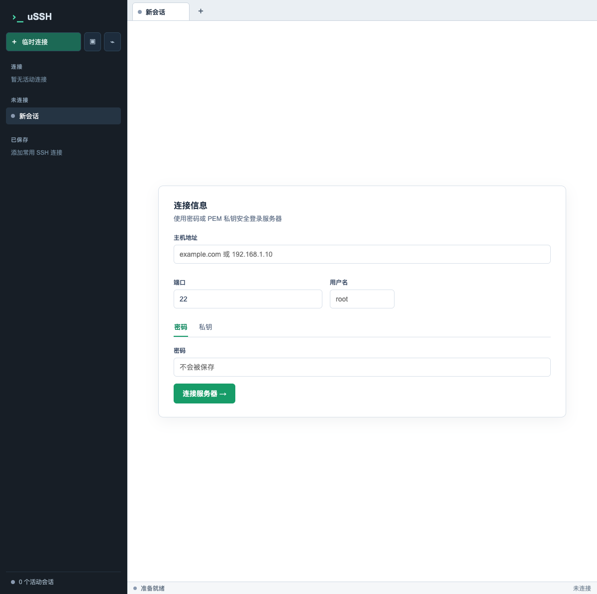
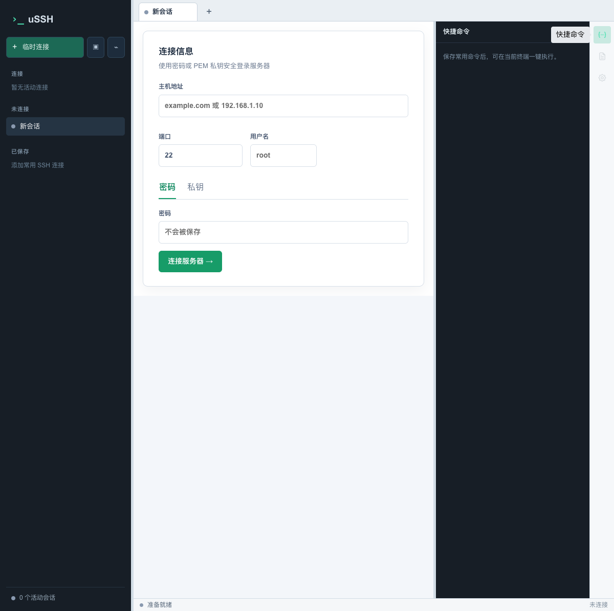

# uSSH

uSSH 是一款基于 [Wails v2](https://wails.io/) 构建的桌面 SSH 客户端。它使用 Go 管理 SSH 会话、SFTP、远程命令和本地数据，使用 React + Vite 构建现代化的多标签终端界面，适合日常服务器登录与运维工作。

## 功能特性

- 多标签 SSH 终端，支持终端自适应、256 色、断开状态提示和终端输出回滚。
- 工作区：可创建多个工作区，分别保留连接标签页和当前会话，切换工作区不会断开连接；下次启动恢复上次工作区及已保存连接标签页。
- 连接树管理：保存 SSH 连接，使用文件夹分组、嵌套、排序、移动、复制和筛选。
- 多种认证方式：密码、内联私钥、私钥文件；私钥支持 passphrase。
- 系统密钥环保存敏感凭证，SQLite 仅保存连接元数据。
- SFTP 文件管理：浏览目录、在线查看和编辑文本文件、新建目录、重命名、删除、上传文件/文件夹和下载文件。
- Docker 工具面板：查看容器、日志、资源统计、Docker Compose 项目，并执行启动、重启、停止和删除操作。
- 服务器监控：查看系统信息、CPU、内存、磁盘、网络、监听端口和进程；支持关闭或强制关闭进程。
- AI 智能体：连接 OpenAI 兼容接口，在当前 SSH 终端中分析问题并按步骤执行命令；支持流式聊天、命令审批、只读命令自动执行、最大步数和单命令超时配置。
- 快捷命令：保存常用命令，在当前终端中一键执行。
- 外观和终端设置：浅色/深色/跟随系统主题、界面密度、字体大小、光标闪烁、回滚行数、复制粘贴行为、透明度、GPU 加速和窗口背景材质。

## 界面预览





## 环境要求

- Go 1.25 或更高版本
- Node.js 和 npm
- Wails CLI v2.14.0
- Wails 所需的桌面 WebView/编译环境。请根据目标系统参考 [Wails 安装文档](https://wails.io/docs/gettingstarted/installation)。

项目使用 Go 模块管理后端依赖，前端依赖位于 `frontend/` 目录。

## 开始开发

克隆项目并安装前端依赖：

```bash
git clone https://github.com/eicesoft/ussh.git
cd ussh
cd frontend
npm install
cd ..
```

启动 Wails 开发模式：

```bash
wails dev
```

开发模式会启动 Vite 热更新。也可以只启动前端开发服务器，用于页面开发：

```bash
cd frontend
npm run dev
```

仅运行 Vite 时，页面不具备完整的 Go/Wails 桥接能力；需要调用 SSH、SFTP 或其他后端方法时，请使用 `wails dev`。

## 构建

在项目根目录执行生产构建：

```bash
wails build
```

构建产物会生成在 `build/bin/`。如果只需要构建前端：

```bash
cd frontend
npm run build
```

预览已构建的前端静态资源：

```bash
cd frontend
npm run preview
```

## 使用说明

### 新建 SSH 连接

1. 在左侧连接区域点击“新增连接”。
2. 填写主机、端口、用户名和认证信息。
3. 可选择密码、私钥内容或私钥文件作为认证方式。
4. 选择保存后，连接信息会出现在连接树中；双击连接即可打开终端。

保存连接时，主机、端口、用户名等非敏感信息写入 SQLite；密码、私钥、passphrase 等敏感信息写入操作系统密钥环。直接连接不会保存连接信息。

### 文件传输、Docker 和监控

建立 SSH 连接后，通过右侧工具栏打开对应面板：

- “文件传输”用于操作远程文件和目录。
- “Docker”依赖远程主机上的 Docker CLI；若当前用户没有 Docker 权限，面板会提示修复方式。
- “服务器监控”通过 SSH 执行远程采集命令。不同操作系统和权限可能导致部分指标不可用。

### AI 智能体

在“设置 → AI 智能体”中配置：

- `Base URL`：OpenAI 兼容 API 地址，例如 `https://api.openai.com/v1`。
- `API Key`：接口认证密钥，可留空。
- 模型：通过 `/models` 获取并选择模型。
- 是否使用原生 function calling。
- 只读命令是否自动执行、单任务最大步数和单命令超时。

AI 智能体必须绑定一个已连接的终端。只读命令可按设置自动执行，其他命令会请求用户确认；高风险命令需要明确确认，交互式或容易导致任务挂起的命令会被拒绝。使用 AI 执行命令前，请确认目标主机和命令影响范围。

## 数据与配置

应用数据保存在操作系统用户配置目录下的 `uSSH/` 目录中：

- `connections.db`：SQLite 连接节点树和连接元数据。
- `app.json`：GPU 加速、窗口背景材质等启动级配置。
- 系统密钥环：保存密码、私钥、passphrase 和私钥文件内容等敏感凭证。
- WebView 本地存储：保存界面设置、AI 配置、快捷命令和 AI 会话历史。

实际配置目录由 Go 的 `os.UserConfigDir()` 根据操作系统决定。卸载或迁移应用时，如需保留连接和设置，请一并备份该目录及系统密钥环中的凭证。

## 项目结构

```text
.
├── main.go                 # Wails 入口、窗口和平台配置
├── app.go                  # SSH 连接、终端输入输出、AI 聊天
├── agent.go                # AI 智能体执行循环和命令审批
├── agent_policy.go         # AI 命令风险识别策略
├── sftp.go                 # SFTP 文件操作
├── docker.go               # 远程命令执行能力，供工具插件使用
├── storage.go              # SQLite 连接树和系统密钥环
├── appconfig.go            # 应用级启动配置
├── frontend/
│   ├── src/components/     # 布局、连接、终端、设置和 UI 组件
│   ├── src/plugins/        # 快捷命令、文件传输、Docker、监控、AI 插件
│   ├── src/hooks/          # 标签页、设置、主题和事件管理
│   └── package.json        # 前端脚本和依赖
├── build/                  # Wails 构建目录
└── wails.json              # Wails 项目配置
```

## 技术栈

- Go 1.25+
- [Wails v2](https://wails.io/)
- [React](https://react.dev/) 18
- [Vite](https://vitejs.dev/)
- [xterm.js](https://xtermjs.org/)
- Tailwind CSS + shadcn/ui 风格组件
- SQLite（`modernc.org/sqlite`）
- SSH（`golang.org/x/crypto/ssh`）
- SFTP（`github.com/pkg/sftp`）

## 测试

运行 Go 测试：

```bash
go test ./...
```

前端源码中的测试文件用于验证终端输出、监控数据和 AI 插件逻辑。当前 `frontend/package.json` 未配置独立的测试脚本；修改前端后建议至少执行：

```bash
cd frontend
npm run build
```

## 安全提示

- uSSH 当前 SSH 客户端使用 `ssh.InsecureIgnoreHostKey()`，不会校验服务器 host key。请仅在可信环境中使用，并在生产环境接入前评估风险。
- 保存凭证会将敏感信息交给操作系统密钥环，请确保当前操作系统账户和密钥环本身受到保护。
- SFTP 删除目录是递归操作，Docker 的停止/删除和监控中的进程终止也可能造成不可逆影响，请操作前仔细确认。
- AI 智能体会在远程主机上执行命令。即使命令审批策略提供了风险分级，也不应将其视为替代人工审查。

## 贡献

欢迎提交 Issue 和 Pull Request。提交代码前请确保 Go 测试和前端生产构建可以通过，并尽量为后端逻辑补充测试。

## 许可证

当前仓库未包含许可证文件。如需在其他项目中分发或集成 uSSH，请先确认项目维护者的授权方式。
